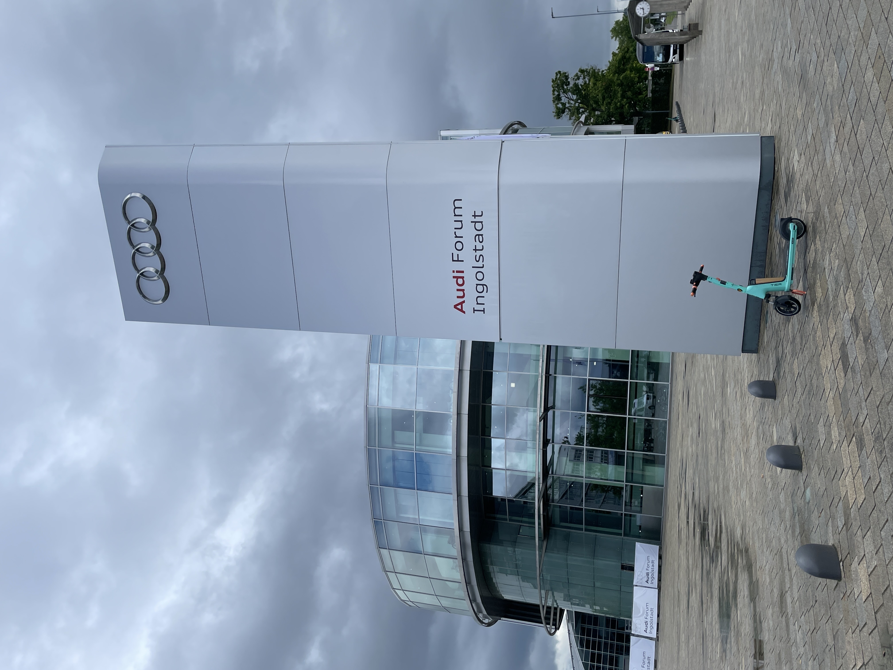
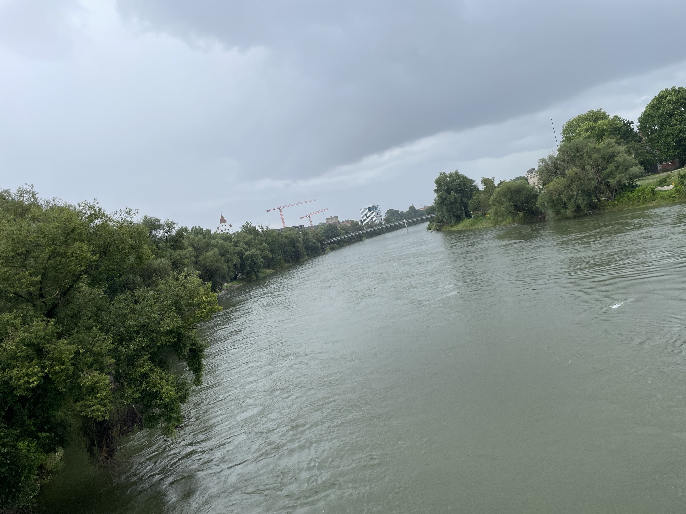

Eine Wanderung längs durch eine Großstadt ist nur in Teilen ein Vergnügen. Dazu hat es dann heute auch noch geregnet. Mit Musik auf den Ohren geht alles. 

Gefühlt bin ich eine Stunde an den AUDI-Hallen vorbei gelaufen. Hilfe! Da würde ich ja meinen Arbeitsplatz nicht wieder finden. Beeindruckend groß!

Die Donau! Sie ist hier schon beeindruckend groß!

Heidi musste wegen ihres Knies nach knapp 10 km aus der Strecke aussteigen und ist mit dem Zug zum Hotel gefahren, um das Bein zu schonen.  Ich bin den Rest alleine gelaufen. Wie gesagt, mit Musik auf den Ohren bin ich auch ans Ziel gekommen. Aber ich habe nicht einmal auf den vielen Kilometern so herzlich gelacht, wie wenn wir zu zweit sind!