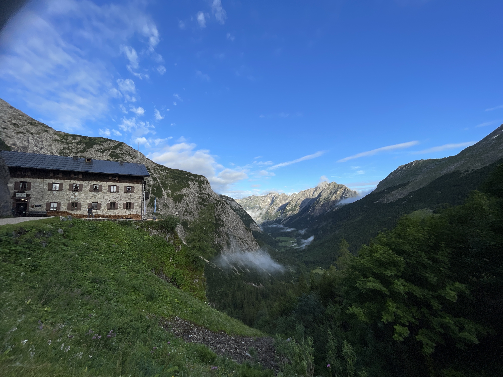

Leider hat das mit dem Blog schreiben in den Bergen überhaupt nicht geklappt. Die Verbindung zum Internet ist, wenn sie überhaupt funktioniert ziemlich wage. Ich fasse die Zeit jetzt erstmal kurz zusammen. \
Von der Tutzinger Hütte bin ich runter zum Gasthof Post in Vorderriß. Dort bin ich am nächsten Morgen schon um 5 Uhr aufgebrochen, ohne Kaffee, ohne Frühstück. Es waren gegen Mittag Gewitter angesagt und für den Tag standen 25 km und 1100 Höhenmeter auf dem Plan.  Also war Tempo angesagt. Es ging 25 km stetig Berg an. Auf den letzten 6 km began es zu regnen. Und so lief 2 Stunden durch ziemlich ungemütlichen Regen. Als ich am Karwendelhaus ankam, war ich bis auf’s Hemd nass und wurde gleich in den Trockenraum geschickt. Ein Traum😂, wenn in einem feucht- warmen Raum 20 Wanderer und Radfahrer Klamotten, Schuhe und Socken trocknen. Das hatte wirklich “Geschmack”😷. Um 12 Uhr konnte ich dann meinen Frühenstückskaffee nachholen. Soweit erstmal bis dahin. Fortsetzung folgt.

