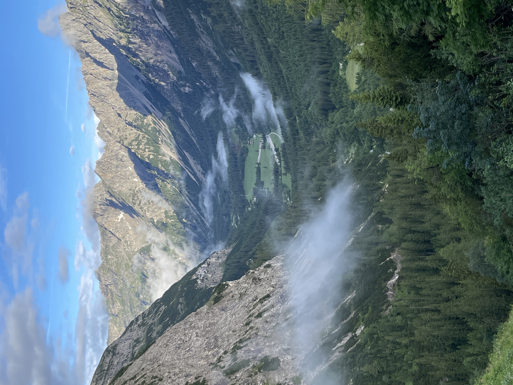

Das Wetter klärte sich zum Nachmittag hin. Die Wolken lockerten sich und die Sonne kam heraus. Ich habe 2 Stunden auf einer Bank gesessen und einfach nur dieses Panorama angeschaut:

Am Abend war dann klar, dass der Weg am nächsten Tag nicht so wie geplant verlaufen wird. Die Birkarspitze ist dicht. Zuviel Schnee, gefährlich, nicht ratsam dort entlang zu gehen. Es wurde in der Hütte diskutiert. Die Umgehung bedeutet: ganz runter ins Tal und zur Hallangerhütte wieder ganz hoch auf den Berg. Darüber musste ich erstmal schlafen. Also bin ich auf meine Matratze gekrabbelt und habe wie ein Baby geschlafen. Obwohl dort ca 25 andere Wanderer mit schliefen, war es eine total ruhige Nacht. Teil 3 folgt