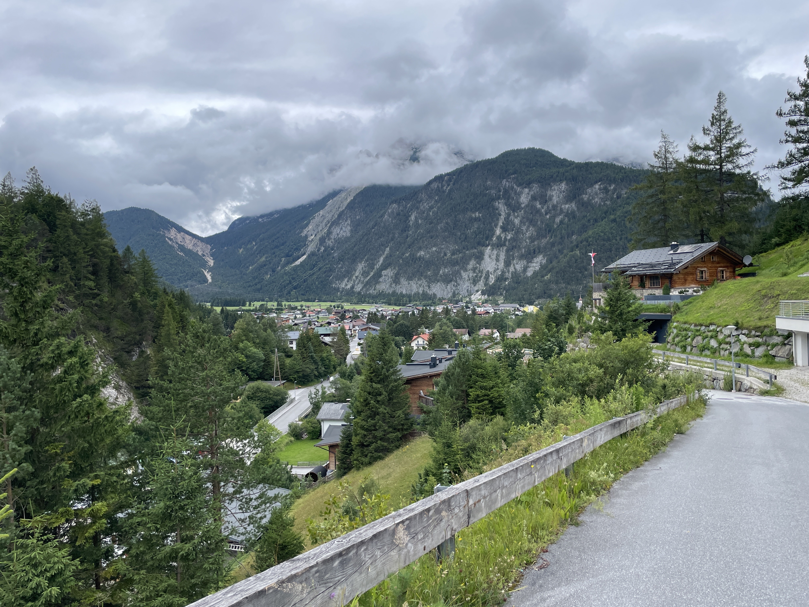
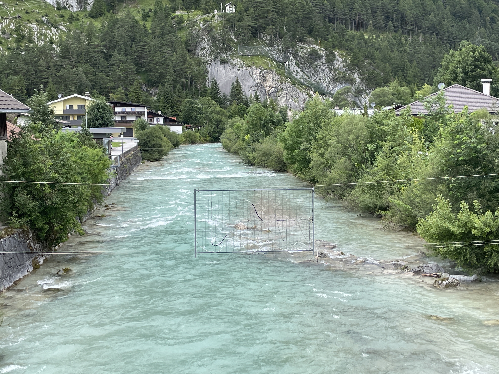

Ich bin mal wieder ohne Frühstück gestartet. Ich hatte keine Lust auf den Trubel in der Gaststube. Außerdem finde ich Hüttenfrühstück um 7:30 Uhr echt zu spät. Es ist so genial früh am Morgen zu starten. Auf dieser Reise gehe ich früh ins Bett und bin meistens spätestens um 6 Uhr wach. \
Der Weg ins Tal nach Scharnitz geht auf einem Schotterweg meistens sachte bergab. Ich bin gemütlich  die 17 km ins Tal gerollt, musste nicht auf jeden Schritt  achten. Ich hatte viel Zeit nachzudenken. 

 Blick auf Scharnitz 

Immer wieder bin ich ein der Isar begegnet. Sie hat so eine beeindruckende Farbe! Echt irre💙💚
