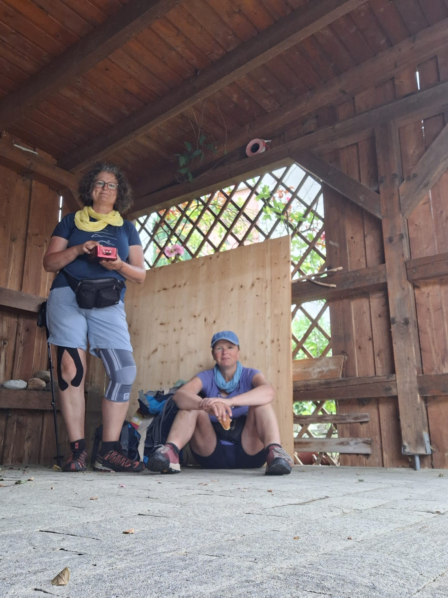

Heute sind wir bei perfekten Wanderwetter knapp 29 km 

gelaufen. Allerdings hatte Heidi in beiden Knien echte Probleme.  Morgen machen wir die 500km voll. Das macht sich in den Gelenken bemerkbar. Einen Regenguss konnten wir unter einem privaten Carport aussitzen  und haben die Pause gleich genutzt und ein bisschen aus unseren Brotdosen gegessen. Es ist erstaunlich, wie wenig man für den Tag braucht. Meistens sind 1 Brötchen, 1 Apfel, 1 Riegel und immer Nüsse dabei und natürlich ca 2 l Wasser. Als wir gerade mitten im Wald, mitten auf der Strecke waren, klingelte mein Handy. Der GroßVater meiner Kinder war dran: “Schick mir mal Deinen Standort”. Kurz bevor wir eine Unterführung der A3 erreichten, entdeckte er uns. Er hatte einen kleinen Umweg auf dem Rückweg aus dem Urlaub in Kauf genommen um uns zu treffen und mir noch ein Geburtstagsgeschenk meiner Töchter zu bringen. 

