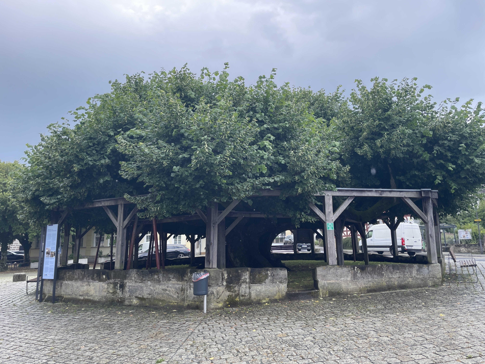

Der 16. Wandertag startete heute schon heiß. Der Wetterbericht zeigte 28 Grad und Gewitter an. Wir planten die Strecke mal wieder um. Statt nur durch Wälder und Felder zu gehen, wählten wir die Variante durch die Dörfer und Ortschaften, damit wir im Falle eines Gewitters sicher unterkommen. Kurz nach unserem Start in Forchheim hatten wir am Trubbach ganz besondere Begegnung. Heidi entdeckte zwei Eisvögel. So nah an der Stadt! Einfach nur genial!                                     Unser  Schritt nach Effeltrich wurde immer schneller. In der Ferne hörten wir Donnergrollen und der Himmel sah auch nicht gut aus. Wir hatten mehr als Glück gehabt und fanden Unterschlupf vor einer großzügig überdachten Gaststättenterrasse. Aus einem dort aufgestellten frei zugänglichen Kühlschrank konnten wir uns bedienen. Das Geld dafür legt man einfach in die Geldkassette. So konnten wir bei kühlem Radler den Gewitterschauer abwarten

Als der heftige Regenguss vorbei und wir weiter konnten, hatten wir eigentlich auf Abkühlung gehofft. Leider Fehlanzeige! Die Luft war zum schneiden heiß und schwül. Die  Strecken durch den Wald waren ein einziger Spießrutenlauf mit den Stechviechern. Wir müssen ziemlich mitleidserregend ausgesehen haben als wir endlich Kalchreuth, ca 5 im von Heroldsberg erreichten, denn eine Frau  fragte, ob wir Wasser, Autan oder sonstige Hilfe bräuchten. Nach fast 32 km mit Mücken, Gewittern und drückender Hitze sind wir mit mega-platten Füßen in unserem kleinen Tankstellenhotel angekommen. Morgen haben die Füße nach 16 Tagen endlich einmal Pause von den Wanderschuhen.                                                  Wir haben jetzt 417 km im Sack! Das ist 1/3 der Strecke! 

