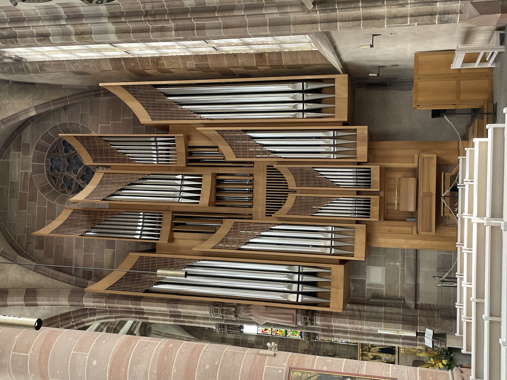

Ursprünglich standen heute 28 km auf unserem Programm. Die Hitzewarnung für Nürnberg haben wir ernst genommen. Unsere Erfahrung mit der Hitze vor ein paar Tagen wollten wir nicht nochmal erleben. Am Ziel ankommen ist dann manchmal auch wichtig. Nützt ja nix, wenn eine von uns beiden zwischen den Feldern und Wiesen kollabiert. Also haben wir unsere Planungen mal wieder über den Haufen geschmissen und sind nur bis Nürnberg gelaufen. Das waren ungefähr 12 km. Selbst in der Morgensonne lief der Schweiß und unser Wasser war nach 12 Kilometern leer gelutscht. Die gut 10 kg Gepäck auf unseren Rücken sind einfach 

 zu unterschätzen! \
In Nürnberg haben wir dann mal Sightseeing gemacht. Ein bisschen Kulter kann ja zwischendurch mal auch nicht schaden. Nürnberg mit seiner Kaiserburg und den beeindruckenden Kirchen (und den großen Orgeln!)  zu erleben, nach Dörfern, Wald und Wiesenwegen war eine willkommene Abwechslung. Unser Zielhotel in Wendelstein sind wir dann heute mal mit U-Bahn und Bus angefahren. Mal wieder eine richtige Entscheidung! Wir liegen jetzt iauf unseren Betten und schwitzen vom Nixtun. Wenn wir die ganze Strecke heute gelaufen wären, wären wir wahrscheinlich weg geflossen …..