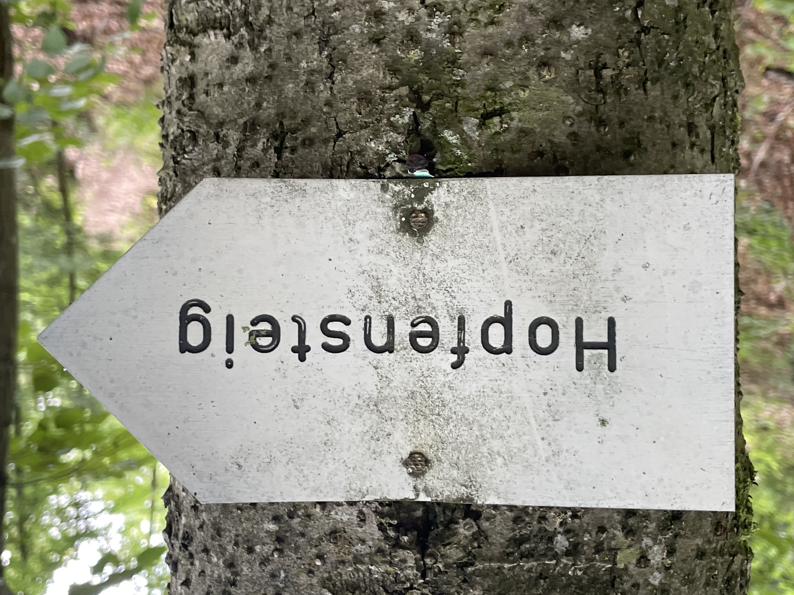
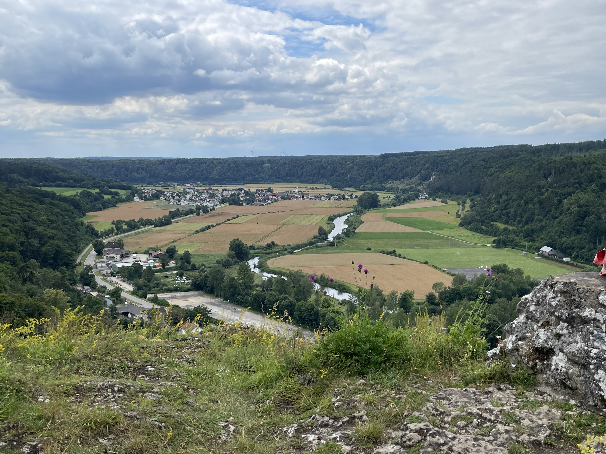
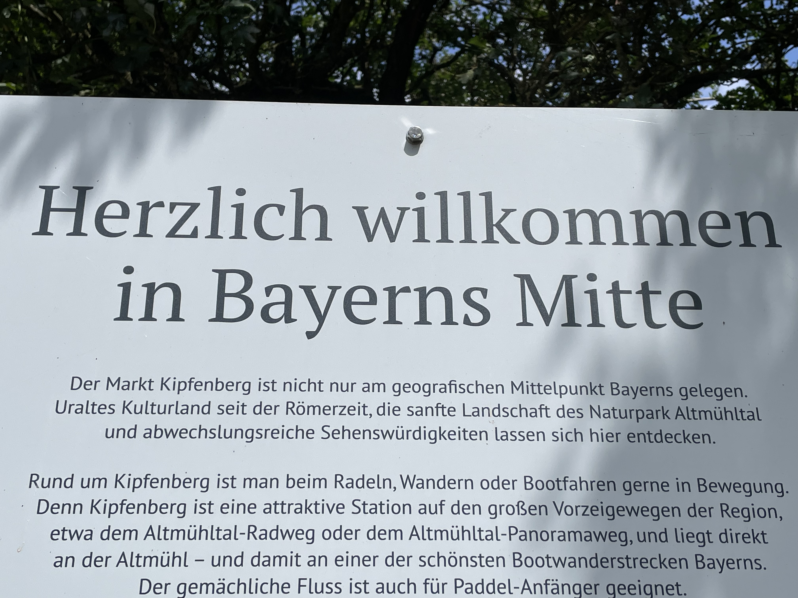
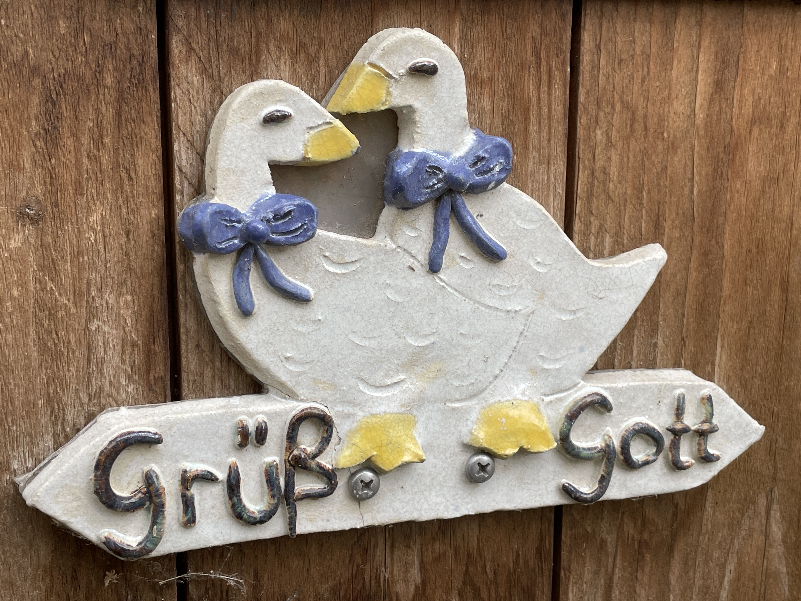
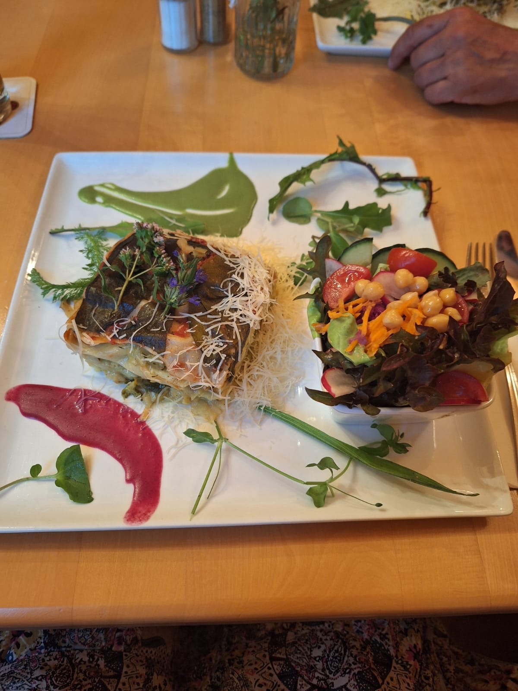

Das war ja schon mal ein etwas unglücklicher Start heute. Die ersten Kilometer auf Wiesenwegen. Das ist ja schon mal Käse. Da waren die Schuhe jedenfalls schon mal nass🙄

Under erster Steig. Ein bisschen Üben für die Alpen.

Unser zweiter Aufstieg über den Schmettetlingssteig wird mit einem tollen Ausblick auf die Altmühl und ihr Tal belohnt 

Wir sind jetzt schon mitten in Bayern!

Hier sagt man jetzt „Grüß Gott“ oder gerne auch „Servus“

Nach knapp 30 km sind wir in Böhmfeld angekommen. Und wurden mit einem tollen Abendessen versorgt! \
Das Wetter passte heute wieder perfekt und wir hatten tolle, abwechslungsreiche Wege. Wir haben heute die 500 km geknackt 💪🏻 und für heute sind unsere Füße auch mal wieder platt. Gleich machen wir unser Licht aus. Es braucht alles immer Zeit: Ankommen , kurz auf dem Bett zusammen brechen, duschen, die Wäsche waschen und irgendwo aufhängen, essen , mit der Familie telefonieren, Tagebücher und Blog schreiben und immer den nächsten Tag noch einmal durchgehen. Und ZACK ist es 23 Uhr. Licht aus!