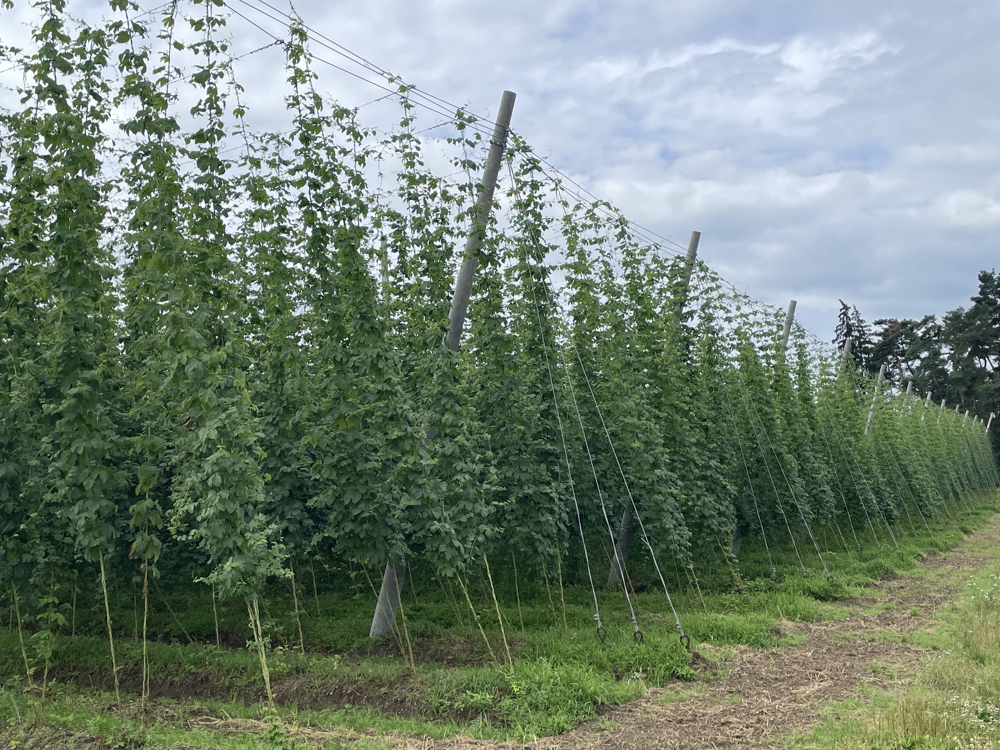
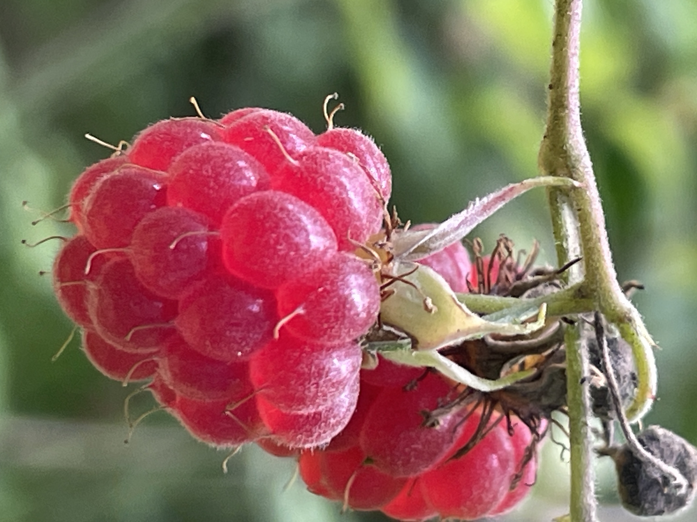
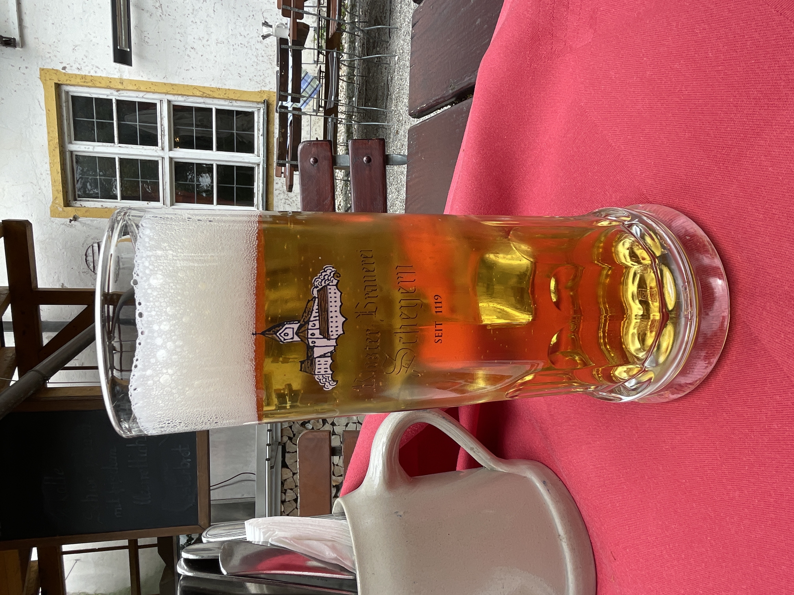

Strecke 31 km bei perfektem Wanderwetter: Sonne, Woken und um die 20 Grad

Hopfenfelder

Dad ist das tolle! Wenn man einfach geht und nichts erwartet wird man von märchenhaften Wäldern überrascht 

Fantastisch lecker!!!

Auch das Kloster Scheyern mit eigener Brauerei lag auf dem Weg. Natürlich habe das Bier auch verkostet😇

Leider konnte Heidi heute nur 12 Kilometer laufen. Das Knie ist derzeit nicht ok. Hoffentlich berappelt es sich. Dir Berge kommen immer näher!