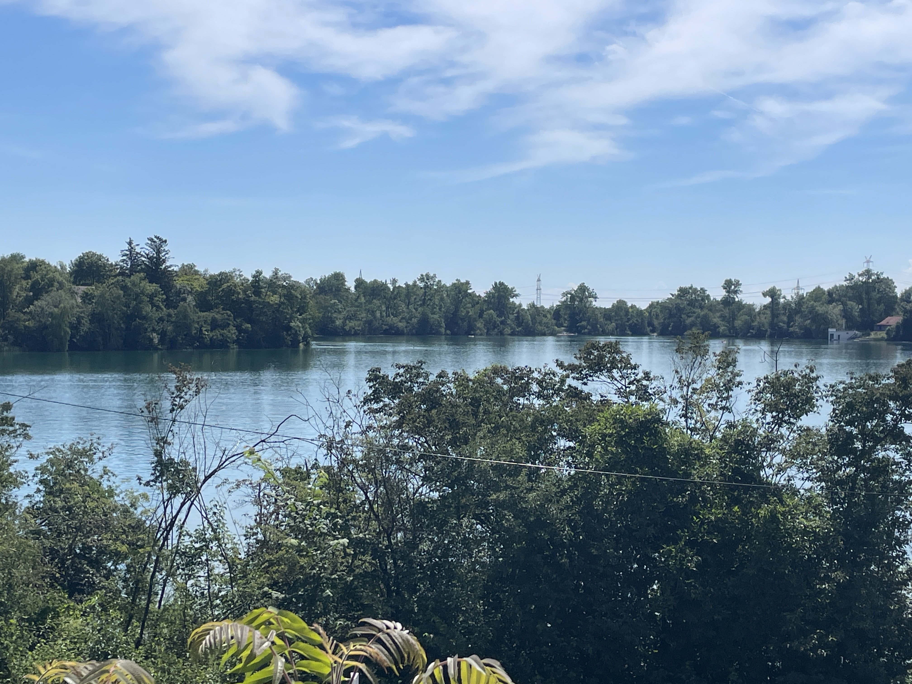
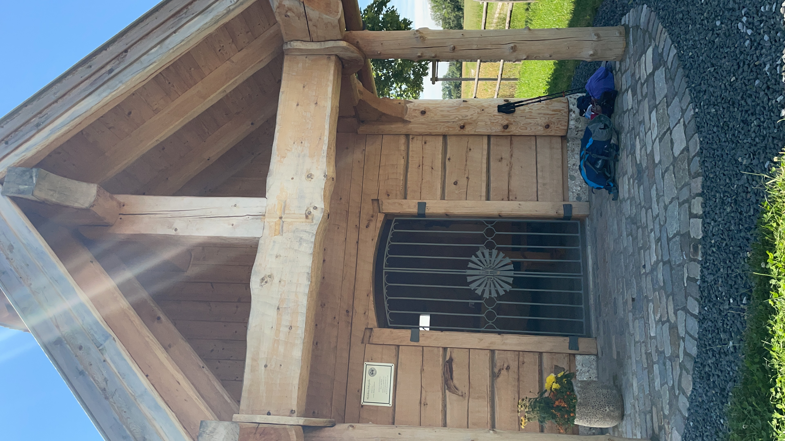
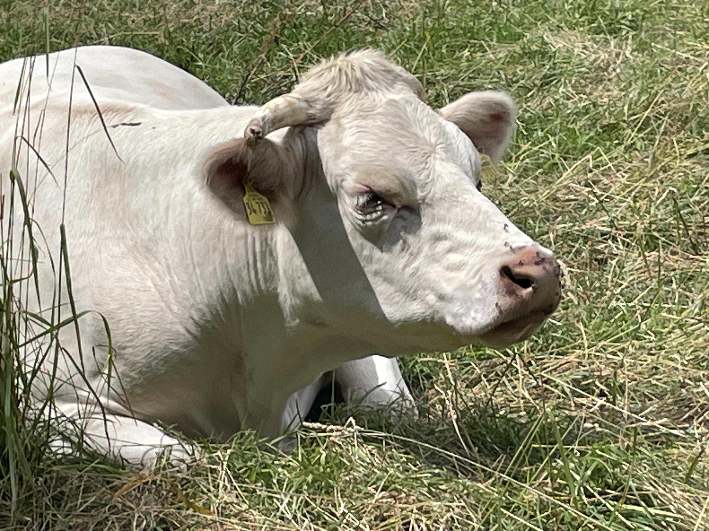
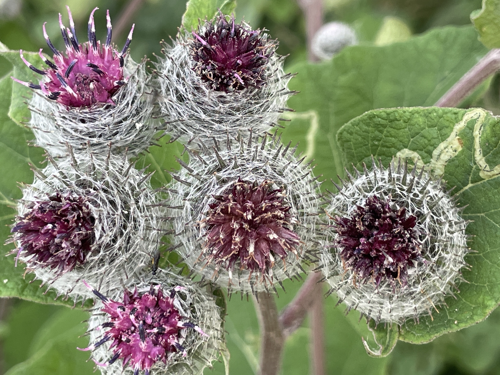

Ich habe mich heute sehr zeitig auf den Weg nach Gauting gemacht. Es waren für den Nachmittag Gewitter angesagt. Aber, bevor der Himmel bedrohlich wurde war es erstmal heiß. Zum Glück hatte ich heute eine Bademöglichkeit auf der Strecke. Als ich mich nach 10 km dem Münchner Naherholungsgebiet näherte kam mir ein nacktes Ehepaar auf dem Fahrrad entgegen. Was mich zuerst ziemlich verwirrte, klärte sich schnell auf. Das Gebiet um den Birksee ist FKK. 

Da ich ja nun aber seit 600 km meinen Bikini mitschleppe bin ich weiter gegangen um dort unter den angezogenen  Schwimmern zu sein. Die Abkühlung tat gut und so konnte ich weiter. Der Weg war heiß und die nächste Pause irgendwann fällig. Eine kleine wunderschöne Holzkappelle sollte mein nächster Schattenspender sein

Soweit , so gut. Das Abspulen der Kilometer lief trotz der Hitze ganz gut. Ich hatte ausgerechnet, dass ich bei dem Tempo etwa eine Stunde vor dem Gewitter im Hotel sein müsste. Hätte gepasst. Allerdings war das Gewitter schneller als ich und erwischte mich mitten im Wald. Ich habe nur noch die Wanderstöcke in die Hand genommen und bin gerannt. Zum Glück kam ich bald an einer Straße heraus. Ich sah ein einzelnes Haus und fand dort in einem Kellereingang Schutz. Heidi hatte heute nochmal ausgesetzt und war schon im Hotel und machte sich Sorgen. Blöderweise funktionierte das Internet nicht. So konnte ich ihr erst etwas später die Nachricht schicken, dass alles in Ordnung ist. Morgen sind nochmal 30 km auf dem Plan und dann ist ein Pausentag. 

