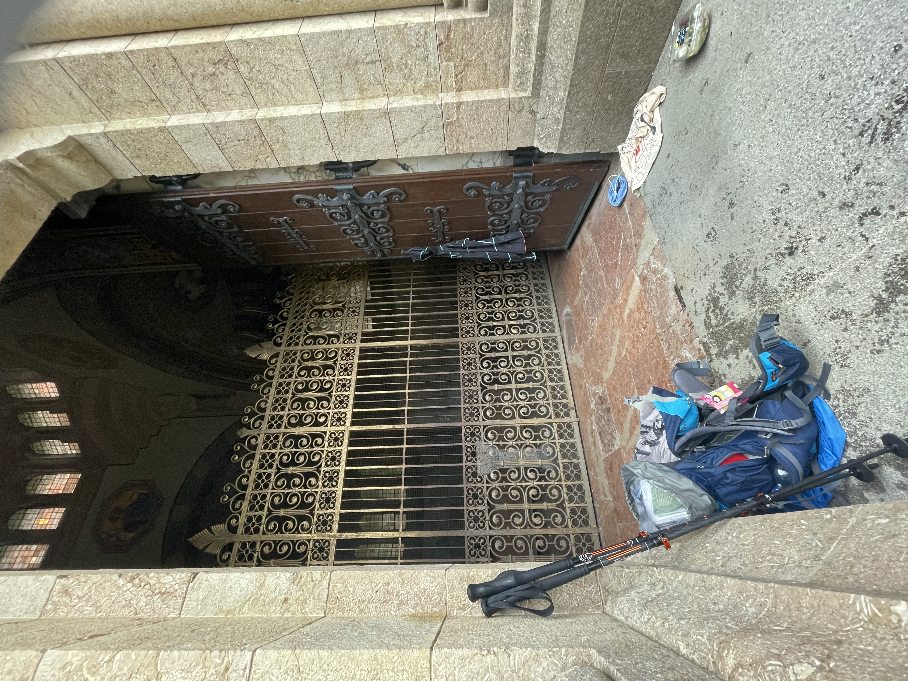
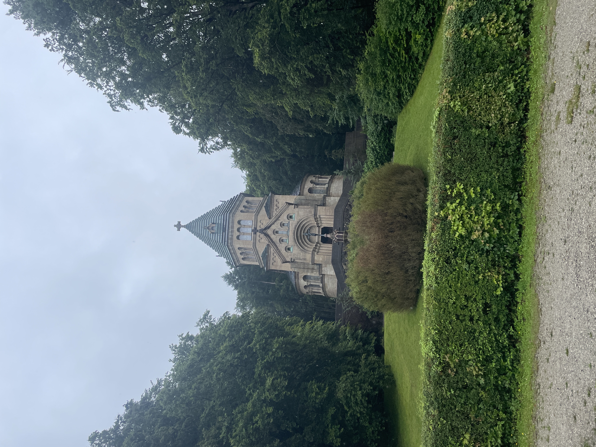

Das Wetter passte zur Stimmung. Wir mussten heute wieder getrennte Wege gehen. Heidi’s Knieschmerzen machten uns einen Strich durch die Rechnung, dass wir gemeinsam den Weg am Starnberger See entlang bis nach Berg gehen konnten. Heidi ist mit dem Zug gefahren und ich bin 6 Stunden Dauerregen marschiert. 

Die Votivkapelle auf meinem Weg war meine Rettung. Im Schutz des Eingangsbereichs konnte ich etwas essen, den Akku meines Handys mit der Powerbank laden und die Regenhose noch drüber ziehen. 

Aber alles Dinge haben ja immer zwei Seiten: wenigsten haben mich die Mücken während des Regens in Ruhe gelassen. 

Meine Wanderschuhe sind heute den letzten Teil dieser Strecke mit mir gelaufen. Morgen haben wir Pausentag und danach wechseln wir das Schuhwerk auf Wanderstiefel. \
Heidi hat morgen einen Termin bei einem Physiotherapeuten. Unsere ganze Hoffnung, dass wir zusammen weitergehen können hängt an seinen Händen!