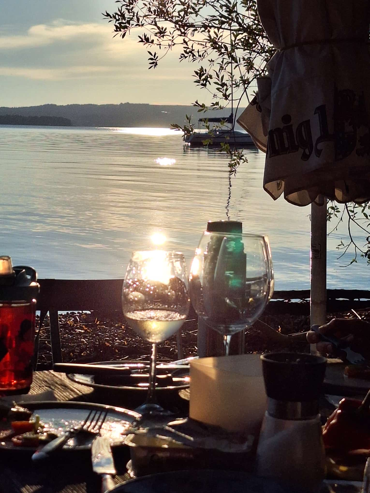
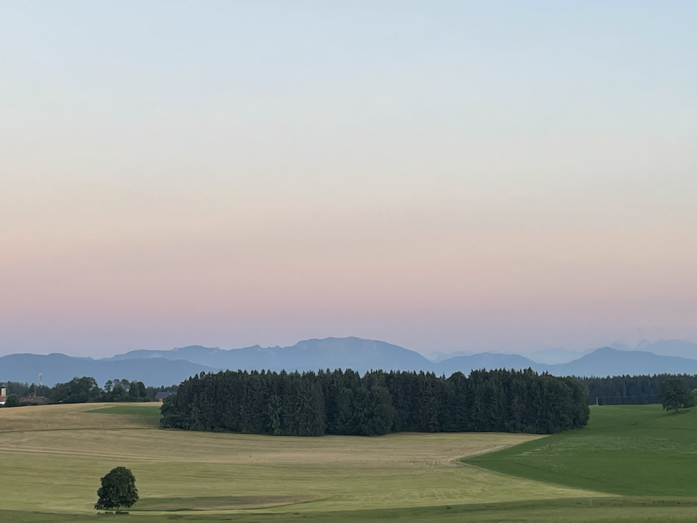

Wir haben gelernt, von Tag zu Tag zu planen. Heute gehen wir mit einem flauen Gefühl im Bauch schlafen. Wir haben uns heute den Tag über ausgeruht, die Beine hoch gelegt, die Füße gepflegt und den Tag genossen. Heidi war zur einer Physiotherapeutin, ich war im  Starnberger See schwimmen und wir haben dort gemeinsam mit Paula und Christian, die uns so lieb für zwei Tage aufgenommen haben eine schöne Brotzeit am Abend genossen. 

Christian ist mit uns zu einer Kapelle, einem fantastischen Aussichtspunkt gefahren. Dort konnten wir einen Blick auf die Berge werfen, die uns erwarten. Ein neuer Wegsbschnitt beginnt morgen. Es bleibt ungewiss, wie es mit Heidi weitergeht. Wir sind angespannt, aber wir planen von Tag zu Tag und morgen geht es auf nach Bad Tölz.