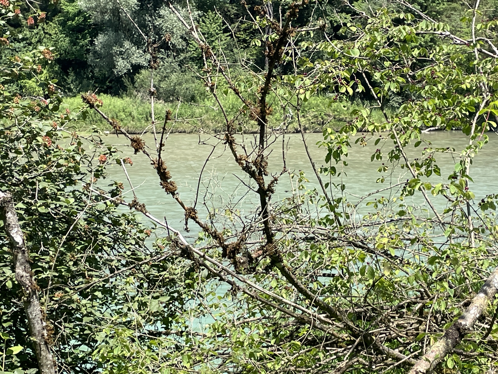
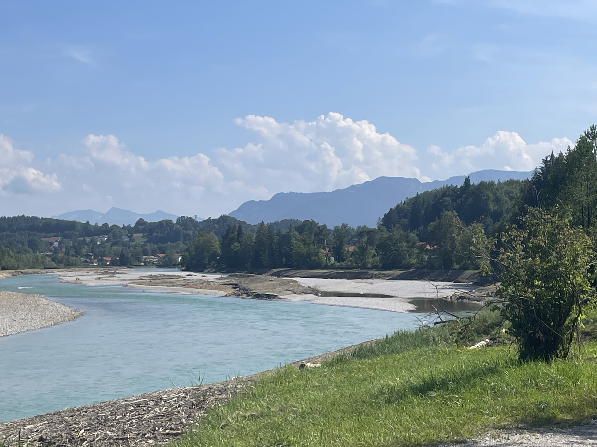
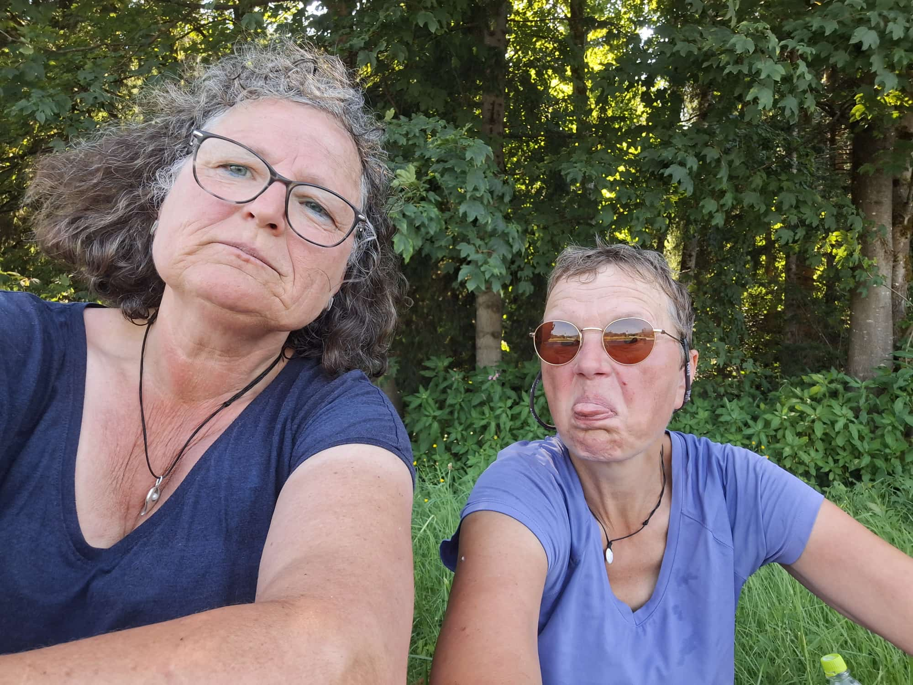

Heute habe ich mich 32 km lang durch Hitze und Mücken geplagt. Heidi ist einen Teil der Strecke mit mir gegangen. Morgen heißt es dann Abschied nehmen. Heidi wird zurück nach Hause fahren. Die Schmerzen im Bein und Knie lassen ein Weitergehen einfach nicht mehr zu. Wir sind beide unendlich traurig. Aber wir haben abgefahrene 4 Wochen hinter uns. Wir haben so viel zusammen gelacht, sind wunderschöne und vôllig bescheuerte Wege zusammen gegangen. Haben jede Nacht in einem frisch bezogenen Bett geschlafen und oft tolles Frühstück genießen dürfen. Wir haben abends im Bett gesessen und total erschöpft Supermarktsalat gefuttert. Wir sind  lustigen und bescheuerten Menschen begegnet. Es sind unvergessliche 4 Wochen. Und weil ich heute einfach nur traurig bin, gibt es jetzt nur noch ein paar Bilder von meinem Wandertag

Der erste Blick durch die Büsche auf die Isar

Moorig-braunes Wasser im Mühlbach 

Die Isar hat so ein tolles türkisfarbenes Wasser!

es war einfach so heiß heute 🥵