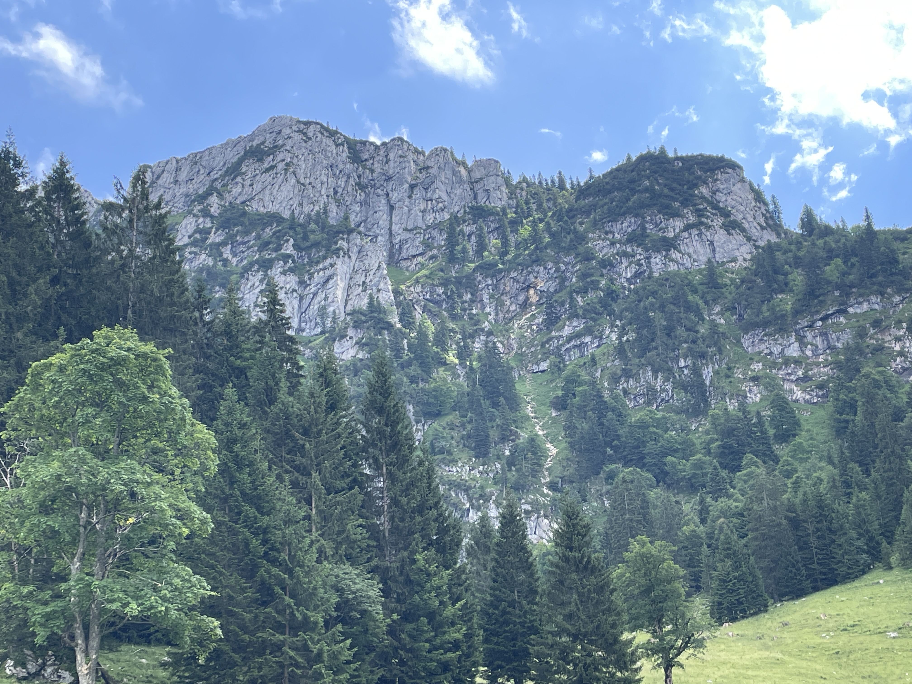

Der Start war schwer. Heidi zurück zu lassen und alleine weiter zu gehen war eine schwere Entscheidung. Ich bin mit einem sehr flauen Gefühl im Bauch gestartet. Die erste Wegstrecke war an der Isar entlang. Es war ziemlich warm und der Schweiß tropfte nur so. Es waren Gewitter angesagt, also gönnte ich mir keine Pause. Stetig bergauf. Immer mal wieder die Benediktenwand im Blick. Irgendwann kamen die Wolken näher und ich zog nochmals im Tempo an. Ein Gewitter am Berg ohne Schutz klang jetzt nicht gerade erstrebenswert. 2 km nur noch….. warum sagt denn meine App Dauer noch eine Stunde? Weil, die Steigung 34 Prozent war, die Felsstufen teilweise 50 cm hoch. Es fühlte sich an, als würde der Berg wie eine Feuerwehrübungsleiter nie enden. Meine Schwiegertochter, eine erfahrene Läuferin, hatte mir ein Energiegel geschenkt. Das habe ich gegessen und eine Minipause gemacht. Mit den so mobilisierten Kräften habe ich den Berg geschafft. Als ich über dem Kamm war, sah ich über dem schon das Unwetter. Ich bin den Trail zur Hütte runter einfach nur noch gerannt. 15 Uhr war ich in der Hütte, 15:15 Uhr war draußen Weltuntergangsstimmung. Mal wieder Glück gehabt 

