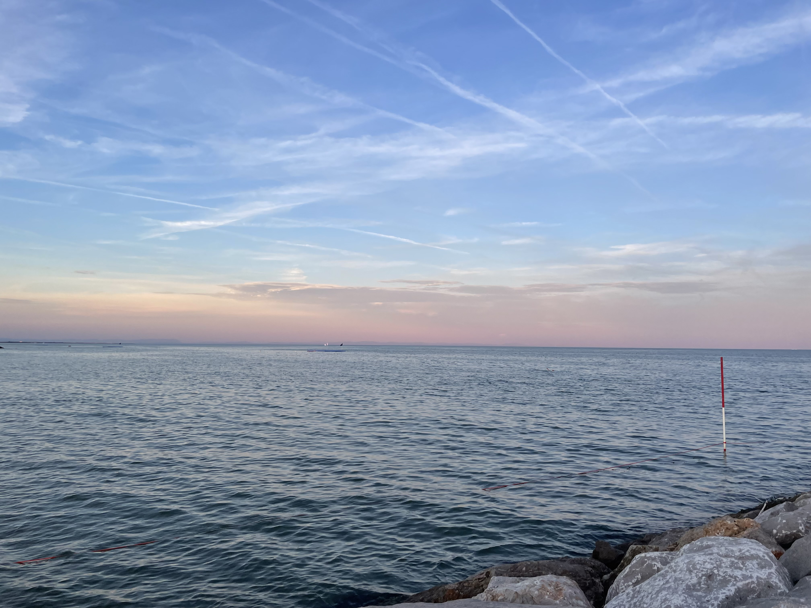
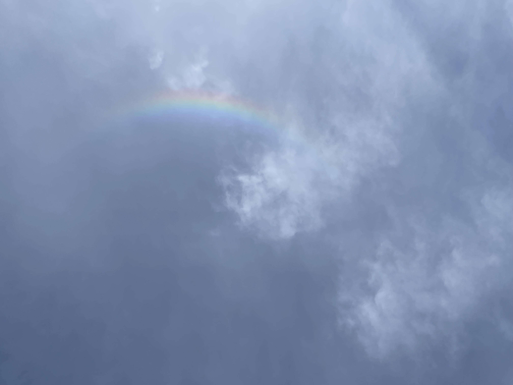

Am nächsten Morgen sollte dann meine letzte Etappe des Tages folgen. Dieses Mal mit schnellerer Durchschnittsgeschwindigkeit, ohne viel eigene Beinarbeit, allerdings auch nicht weniger anstrengend. Ich machte mich auf den Weg zum Hauptbahnhof und stieg dort in einen völlig überfüllten Zug.                   4 Stunden stehend nach Venezia Mestre.  Dann noch zweimal umsteigen und dann……Die letzten 2,58 km.                                 WhatsApp-Videoanruf zu Heidi und dann …..sind wir gemeinsam zum Meer gelaufen. Ziel erreicht!!!!

Dieser Regenbogen ohne Regen stand über uns als wir sozusagen zusammen angekommen waren. Wenn das kein Zeichen war!