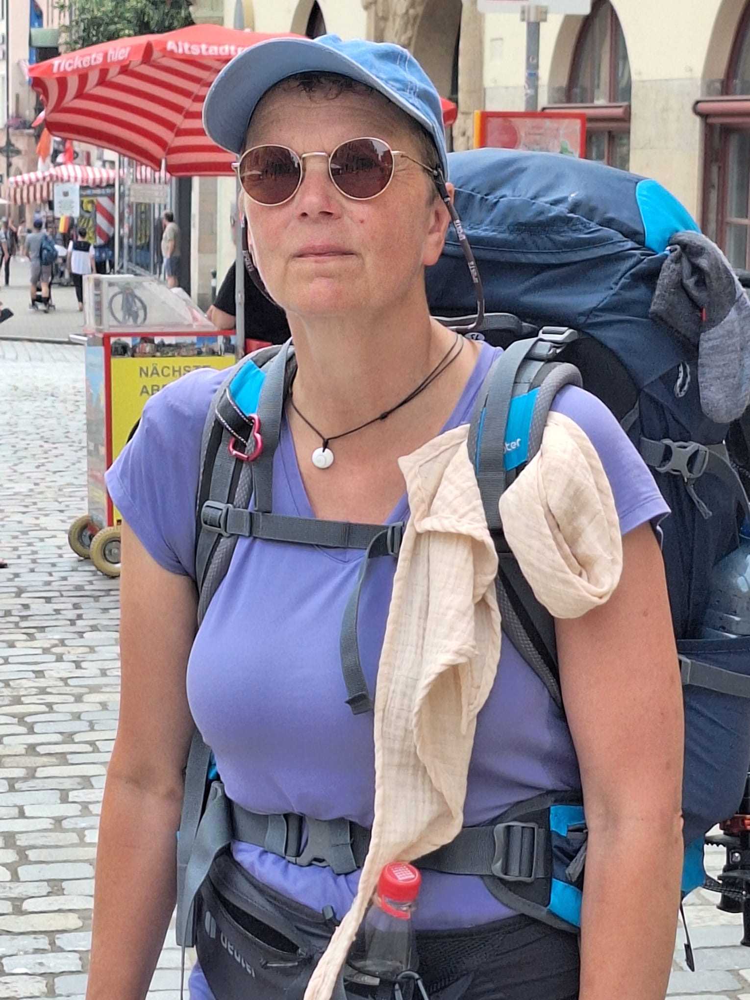

HEIDI:                                                                      Tag 29 von Bad Tölz nach Kaierde..... der letzte Tag dieser Wunderbaren Reise.  Nach dem Frühstück und einem Abschiedsfoto haben Kati und ich uns, unter Tränen in den Arm genommen.  Ich bin dankbar, dass Kati es alleine weiter versucht.
Es war für mich nicht leicht die Entscheidung zu treffen, nicht weiter zu gehen, aber mein rechtes Bein hat es nicht zugelassen. 
Also gingen wir nun in genau entgegengesetzte Richtungen..... Kati Richtung Berge und ich mit den Bergen im Rücken zum Zug. 
Mit der Regio nach München und dann mit dem ICE nach Göttingen. Mit einer Stunde Verspätung war ich dann endlich in Freden. Mir kam ein kleiner Wirbelwind entgegen gelaufen. "Oma bald wieder gut" hat er gesagt, mit dem Blick auf mein Knie. Es war so schön meine Familie und auch meine  kleine neugeborene Enkeltochter zu sehen. 
Diese kleinen Wesen haben die Trauer ein bisschen erleichtert.  Wie gerne wäre ich weiter gegangen. 
Aber ich bin auch unfassbar Stolz auf  uns. Wir sind bis München zu Fuß gegangen.  Hatten so viel Spaß miteinander. Jeden Tag haben wir Tränen gelacht.  Wir haben wunderbare Momente der Freude und der Rührung miteinander geteilt.  Es war unbeschreiblich schön. Wir sind durch Dörfer und Städte gegangen, haben neue Dinge kennengelernt,  z. B. Tanzlinden, waren im Wald und Feld unterwegs. Die Gedanken waren bei uns und es gab nur den Rucksack in dem alles war, was wir brauchten. 
Einfach nur Gehen. In mir war eine unfassbare Ruhe. 
Wunderbar und Empfehlenswert.
Ohne den Traum von Kati wären wir nicht losgezogen, hätte das alles nicht erlebt. Wir haben es versucht,  nun ist es am Ende bei mir anders gekommen, als geplant. Ja das ist schade, das Ziel nicht erreicht zu haben. 
"Jeder der Großes versucht, ist bewundernswert, auch wenn er fällt."(Seneca)
Und ich habe es versucht. 
Danke Kati für deinen Traum,  ohne den hätten wir unsere ganzen Wanderungen nicht gemacht.
Wenn das Bein wieder heil ist, jederzeit wieder. 😃

Was nehme ich mit von meiner Reise? 
Es war eine fantastische Zeit. Das Gefühl von Freiheit. Diese Tage, die nur aus Laufen, Essen und Schlafen bestanden und alles was man braucht in einem Rucksack auf dem Rücken. Wir sind von Kaierde bis Österreich durch die Regionen gewandert und haben dabei ganz intensiv erfahren wie Land und Leute sich verändern. Ich habe meinen Mann, meine Familie und meine Freunde sehr  vermisst und mir ist einmal mehr bewusst geworden, dass sie mir das Wichtigste im Leben sind. Allerdings hat mir der 5 wöchige Abstand zum Alltag viel Raum gegeben Dinge für mich zu klären. Ich komme gestärkt zurück. Mein Akku hat wieder 100 Prozent. Ich fühle in mir eine innere Zufriedenheit und eine innere Gelassenheit. Und ich kann für mich sagen, ich habe meine geplante Wanderung bis ans Meer nicht abgebrochen. Mein Ziel war wohl der Weg. Und den bin ich gegangen bis ich den “magischen Moment” empfunden habe und mir klar wurde: “Es ist genug, ich bin angekommen.” Dass ich das Meer dann doch noch sehen wollte, dass bin dann einfach ICH. Dafür muss man schon wieder verrückt genug sein, um für nicht einmal 24 Stunden von Innsbruck nach Caorle zu fahren. 
Alles richtig gemacht. Nicht nur träumen! Machen! Und wenn der Weg dann am Ende anders läuft oder man sein Ziel nicht erreicht, dann hat man es wenigstens versucht und es bleibt nicht bei dem Satz der mit den Worten beginnt: “Ich wollte auch eigentlich immer mal….”
Danke Heidi für die gemeinsamen Wege und die Tränen, die wir jeden Tag zusammen gelacht haben und am Ende auch zusammen geweint haben. Gut dass wir losgegangen sind! Wir können jetzt sagen: “Wir wollten nicht nur mal, sondern wir sind los gegangen!”